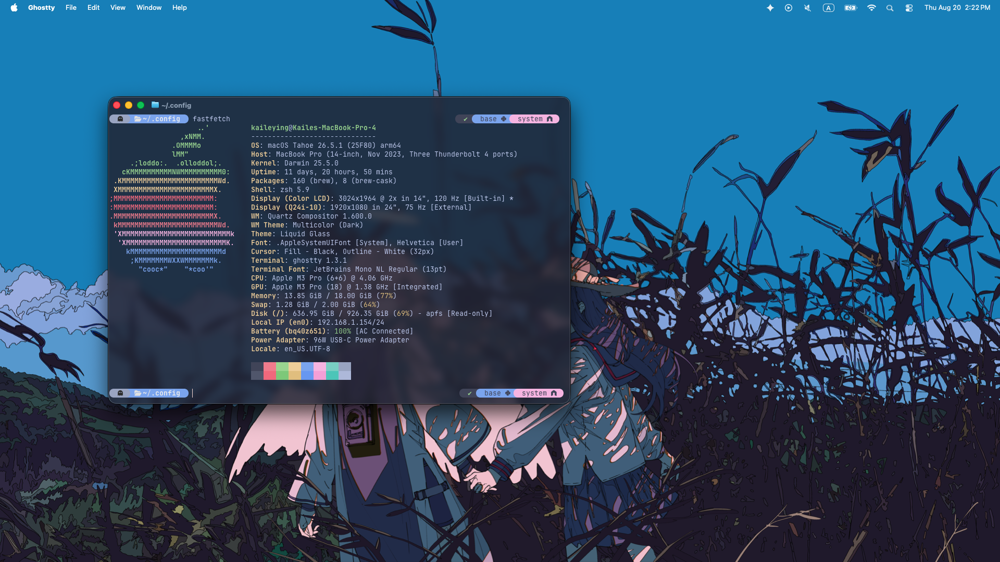
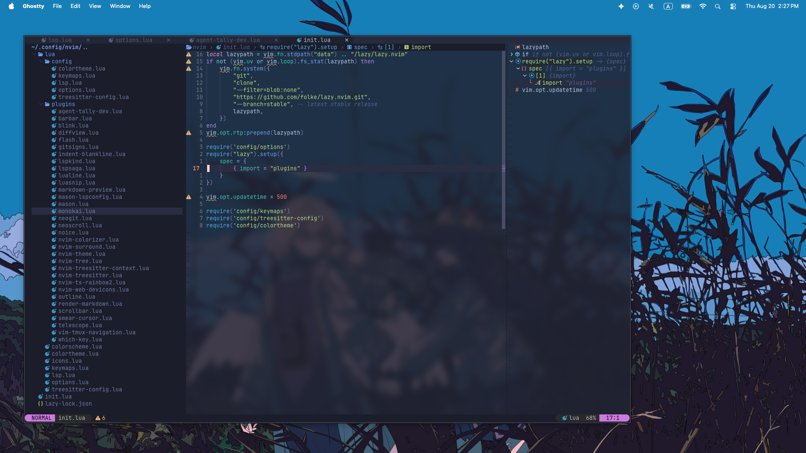

# Dot Files

Personal dotfiles for my macOS development setup — Neovim, Zsh, Ghostty, and iTerm2.




## Contents

| Path | What it is | Where it goes |
| --- | --- | --- |
| `nvim/` | Neovim config (Lua, [lazy.nvim](https://github.com/folke/lazy.nvim)) | `~/.config/nvim` |
| `macos/zshrc` | Zsh config (oh-my-zsh + powerlevel10k) | `~/.zshrc` |
| `macos/.p10k.zsh` | Powerlevel10k prompt theme | `~/.p10k.zsh` |
| `macos/setup_macos.sh` | Homebrew bootstrap for a fresh Mac | run once |
| `ghostty/config` | [Ghostty](https://ghostty.org) terminal config | `~/Library/Application Support/com.mitchellh.ghostty/config` |
| `iterm2/iTerm2_State.itermexport` | iTerm2 settings export | import from iTerm2 |

## Setup

```sh
git clone --recurse-submodules <this-repo> ~/Documents/Repos/dots
cd ~/Documents/Repos/dots

# 1. Install tooling (Homebrew, neovim, oh-my-zsh, p10k, yazi, kubectl, ...)
sh macos/setup_macos.sh

# 2. Symlink the configs
ln -s "$PWD/nvim"          ~/.config/nvim
ln -s "$PWD/macos/zshrc"   ~/.zshrc
ln -s "$PWD/macos/.p10k.zsh" ~/.p10k.zsh
ln -s "$PWD/ghostty/config" ~/Library/Application\ Support/com.mitchellh.ghostty/config
```

For iTerm2: **Preferences → General → Settings → Import** and select
`iterm2/iTerm2_State.itermexport`.

Open `nvim` afterwards — lazy.nvim bootstraps itself and installs all plugins on
first launch.

## Neovim layout

```
nvim/
├── init.lua              # bootstraps lazy.nvim, loads config/*
├── lazy-lock.json        # pinned plugin versions
└── lua/
    ├── config/           # options, keymaps, lsp, treesitter, colortheme
    └── plugins/          # one file per plugin spec
```

## Notes

- The repo uses a git submodule (`nvim-lspconfig`), so clone with
  `--recurse-submodules` or run `git submodule update --init`.
- Shell aliases worth knowing: `n` → `nvim`, `k`/`kubectl` → `kubecolor`.
